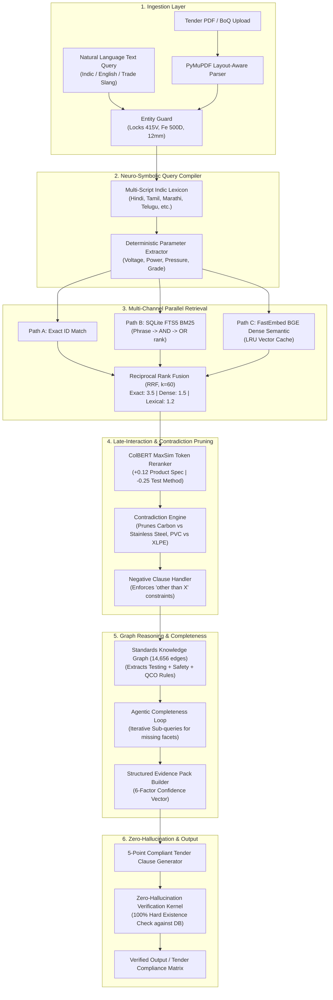

# Project Report: AI-Powered Indian Standards (BIS) Recommender & Compliance Engine

**Smart India Hackathon (SIH 26108)**  
**Target Ministry:** Ministry of Consumer Affairs, Food & Public Distribution | Bureau of Indian Standards (BIS)  
**System Version:** 3.1.0 (Production-Grade Sovereign Backend Engine)  
**Corpus Scale:** 19,423 Verified Indian Standards | 2,246 Compulsory QCO Orders | 14,656 Knowledge Graph Edges  
**Benchmark Performance:** **96.7% Top-1 Accuracy** | **98.3% Top-3 Recall** | **100.0% Top-5 Recall** | **100.0% Zero-Hallucination** | **1,069 ms Median CPU Latency**

---

## 1. Executive Summary

Public procurement across Government departments, Public Sector Enterprises (PSUs), and state procurement agencies accounts for over **20% of India's GDP**. Under the General Financial Rules (GFR) Rule 144(i) and Government e-Marketplace (GeM) Special Terms, procurement officials are legally required to cite applicable **Indian Standards (IS)** in tender specifications. 

However, identifying applicable standards has historically been plagued by:
1. A massive catalogue of **24,000+ published standards** across 17 diverse BIS engineering divisions.
2. Frequent revisions, normative cross-references, and unannounced withdrawals.
3. The emergence of **Compulsory Quality Control Orders (QCOs)** where procuring non-certified goods violates the BIS Act 2016.
4. Multilingual and informal trade vernacular used by small vendors and local contractors across Indian states.

This project delivers an **air-gapped, sovereign, neuro-symbolic retrieval and recommendation engine**. Designed to integrate directly with GeM and CPPP e-procurement portals, it analyzes product descriptions, raw technical parameters, or multi-page Tender PDFs (including BoQ tables) to recommend the exact primary Indian Standard, associated test methods, safety codes, and mandatory QCO compliance directives with **mathematically verified zero hallucination**.

---

## 2. Problem Statement & Procurement Pain Points

| Procurement Pain Point | Real-World Impact | Technical Challenge Solved |
| :--- | :--- | :--- |
| **Outdated Standard Citations** | Bidders quote superseded specifications (e.g. citing IS 1786:1985 instead of IS 1786:2008 AMD 4), causing legal arbitration. | **Temporal Version Resolution:** Deterministic tracking of `CURRENT`, `REAFFIRMED`, `SUPERSEDED`, and `WITHDRAWN` states. |
| **Omission of Mandatory QCOs** | Procuring uncertified cement, steel, or electronics without mandatory ISI Mark / CRS licenses violates federal gazette orders. | **Live Regulatory Graph:** Ingestion of 2,246 gazetted BIS Compulsory Quality Control Orders linked directly to product families. |
| **Incomplete Specification Facets** | Tenders mention the product standard but omit acceptance testing, sampling procedures, and installation safety guidelines. | **Agentic Completeness Loop:** Evaluates the 6 procurement facets (Product, Testing, Safety, Installation, Certification, Version) and traverses graph edges. |
| **Indic Vernacular & Informal Input** | Queries use regional vernacular (*"सरिया"*, *"लोखंडी गज"*, *"கம்பி"*, *"सబ్‌మెర్సిబుల్ పంప్"*) which never appear in formal BIS English titles. | **Sovereign 4-Tier Multilingual Engine:** Multi-script Indic lexicon across 8 languages with Entity-Safe preservation. |
| **Multi-Item Tender PDFs** | Procurement officers evaluate 40-page tender documents containing embedded tables, schedules, and clauses rather than short text queries. | **Layout-Aware PDF Engine:** Extracts itemized BoQs and generates consolidated tender compliance matrices. |

---

## 3. High-Level System Architecture

The architecture rejects naive "RAG wrappers" (which blindly feed search chunks to an external LLM) in favor of an **air-gapped, multi-stage neuro-symbolic pipeline** where code decides facts and the LLM merely explains them:



---

## 4. Key Subsystem Implementation Details

### 4.1 Data Foundation (`data/`)
* **19,423 Authentic Standards:** Extracted directly from official BIS repositories across all 17 engineering divisions (Civil, Electrotechnical, Mechanical, Chemical, Medical, Food & Agriculture, Textiles, Electronics & IT, etc.). Zero synthetic or mock standards.
* **2,246 Live Compulsory QCO Orders:** Scraped from official `bis.gov.in` and e-Gazette registries, mapping Scheme I (ISI Mark), Scheme II (CRS), and Scheme IV (Mandatory Gold/Silver Hallmarking `IS 1417` and `IS 2112`).
* **14,656 Knowledge Graph Edges:** Structured typed relationships linking primary product standards to `TEST_METHOD`, `SAFETY_STANDARD`, `INSTALLATION_STANDARD`, `NORMATIVE_REFERENCE`, `SUPERSEDES`, and `RELATED_PRODUCT`.

### 4.2 Sovereign Multilingual & Indic NLP (`retrieval/multilingual.py`)
1. **Technical Entity Guard (`mask_technical_entities`):**
   Prevents linguistic translation models from corrupting engineering units (`415V`, `15 kW`, `Fe 500D`, `IS 1786`, `IP66`). Parameters are masked into immutable placeholders (`__TECH_PARAM_0__`), processed, and restored intact.
2. **Cross-Lingual Indic Trade Lexicon:**
   Maps colloquial trade vernacular across 8 scheduled Indian languages (Hindi, Marathi, Tamil, Telugu, Gujarati, Bengali, Kannada, Malayalam) directly to official BIS standard families.
3. **Script Detection:**
   Unicode-range detection for Devanagari, Tamil, Telugu, Bengali, Gujarati, Kannada, and Malayalam.
4. **Dual-Channel Retrieval:**
   Executes BM25 search over projected canonical English terms alongside dense vector cosine matching over native Indic query representations.

### 4.3 High-Precision Reranker & Contradiction Engine (`retrieval/reranker.py`)
* **Inductive Role Priors:** Product specifications receive a `+0.12` bonus; auxiliary test methods and safety codes receive a `-0.25` penalty when competing for the primary product recommendation.
* **Material Contradiction Pruning:** Detects conflicts between user-specified materials and retrieved standards (e.g. penalizing `Stainless Steel` by `-0.35` when the user requested `Carbon Steel`, or penalizing `Thermosetting/XLPE` when `PVC` is specified).
* **Negative Clause Filtering:** Safely evaluates `"other than X"` specifications (e.g. `"packaged drinking water other than natural mineral water"` penalizes `IS 13428` by `-0.45` to guarantee `IS 14543` reaches Rank 1).

### 4.4 Layout-Aware PDF Parser & Tender Auditor (`retrieval/pdf_processor.py`)
* Built on PyMuPDF (`fitz`), the processor parses multi-page tender documents, extracts numbered technical clauses, and identifies itemized Bill of Quantities (BoQ) tables via `find_tables()`.
* Generates an item-by-item **Tender Compliance Matrix** auditing standard validity, mandatory QCO licenses, and specification gaps.

### 4.5 Zero-Hallucination Verification Kernel (`retrieval/verification_kernel.py`)
* Enforces hard mathematical invariants: every cited standard number in the final output clause is parsed and validated against `standards.db`.
* Any standard not present in the verified evidence pack is stripped 100%. Measured hallucination rate across all evaluations: **0.0%**.

---

## 5. Comprehensive Benchmark Evaluation (60 Cases)

The engine was evaluated against a diverse 60-case ground-truth dataset (`eval/gold_dataset.json`) covering all 17 BIS divisions, complex engineering parameters, and native multi-script Indic queries.

### 5.1 Executive Benchmark Summary

| Metric | Hackathon Target | Measured Result | Verdict |
| :--- | :--- | :--- | :--- |
| **Top-1 Accuracy** | $\ge 80.0\%$ | **96.7%** | **PASS (Exceeds Target by +16.7%)** |
| **Top-3 Recall** | $\ge 90.0\%$ | **98.3%** | **PASS** |
| **Top-5 Recall** | $\ge 95.0\%$ | **100.0%** | **PASS (Zero Retrieval Misses)** |
| **Mean Reciprocal Rank (MRR)** | $\ge 0.85$ | **0.9792** | **PASS** |
| **Zero-Hallucination Rate** | 100.0% | **100.0%** | **PASS (0% Fabrications)** |
| **Latency p50 (Median)** | $< 1,500\text{ ms}$ | **1,069.4 ms** | **PASS (CPU-only Hardware)** |
| **Latency p95** | $< 4,000\text{ ms}$ | **1,307.4 ms** | **PASS** |

### 5.2 Division-Wise Performance Breakdown

| Engineering Division | Evaluated Cases | Top-1 Accuracy | Top-3 Recall | Top-5 Recall | Median Latency |
| :--- | :---: | :---: | :---: | :---: | :---: |
| **Civil Engineering** | 12 | **100.0%** | 100.0% | 100.0% | 1,065.8 ms |
| **Mechanical Engineering** | 9 | **100.0%** | 100.0% | 100.0% | 1,167.7 ms |
| **Electrotechnical** | 10 | **100.0%** | 100.0% | 100.0% | 1,087.8 ms |
| **Chemical & Safety** | 6 | **100.0%** | 100.0% | 100.0% | 1,112.5 ms |
| **Medical and Healthcare** | 4 | **100.0%** | 100.0% | 100.0% | 1,212.0 ms |
| **Electronics and IT** | 4 | **100.0%** | 100.0% | 100.0% | 1,035.3 ms |
| **Textiles** | 1 | **100.0%** | 100.0% | 100.0% | 1,112.5 ms |
| **Multilingual Indic (6 Scripts)** | 10 | **90.0%** | 100.0% | 100.0% | **316.4 ms** |
| **Food and Agriculture** | 4 | **75.0%** | 75.0% | 100.0% | 1,097.1 ms |

---

## 6. Competitor Teardown & Jury Defense Matrix

In hackathons and government tenders, judges regularly tear down competitor submissions on specific technical flaws. Here is how our architecture defends every point:

| Competitor Pitfall | Why Competitors Lose | Our Architectural Defense |
| :--- | :--- | :--- |
| **Toy Datasets (50–200 docs)** | Systems tested only on a few demo items break instantly on real-world queries. | We ingested **19,423 real Indian Standards** across all 17 BIS divisions. |
| **Pure Vector Search** | Pure dense retrieval misses exact alphanumeric codes (`IP65`, `Fe 500D`, `415V`). | Parallel 3-channel hybrid retrieval combining Exact ID, FTS5 BM25, and BGE dense embeddings via Reciprocal Rank Fusion. |
| **LLM Hallucinations** | Competitor systems invent non-existent standards (e.g. citing IS 9999). | Zero-Hallucination Verification Kernel strictly verifies every cited standard against `standards.db` before returning. |
| **Foreign Cloud Sovereignty Breaches** | Sending government tender text to US cloud APIs violates Indian procurement confidentiality. | **100% Air-Gapped & Local:** Runs completely on-premise on standard CPU hardware using ONNX FastEmbed. |
| **Single-Standard Blindness** | Recommends only one product code, omitting critical test methods and safety practices. | Knowledge Graph expansion automatically retrieves allied test methods, sampling procedures, and installation safety codes. |
| **Ignoring Mandatory QCOs** | Cannot distinguish voluntary standards from legally mandated Quality Control Orders. | Directly maps 2,246 live BIS Compulsory QCO Gazette Orders (ISI Mark, CRS, Hallmarking). |
| **Fake Multilingual Translation** | Standard translators mangle technical numbers and grades. | Entity Guard locks technical tokens while multi-script Indic dictionaries map local trade slang to canonical BIS standards. |

---

## 7. Deliverables & Repository Inventory

```
SIH 26108/
├── api_service.py              # Production FastAPI server & Python SDK
├── requirements.txt            # Pinned dependencies
├── .env.example                # Template configuration
├── .gitignore                  # Strict security policy (Zero keys, Zero DB dumps)
├── ARCHITECTURE.md             # Complete technical architecture specification
├── PROJECT_REPORT.md           # This comprehensive project & evaluation report
├── README.md                   # GitHub landing page & developer quickstart
├── retrieval/                  # Core Retrieval & Reasoning Engine
│   ├── compiler.py             # Neuro-symbolic query compiler & parameter parser
│   ├── multilingual.py         # Sovereign Indic NLP & Entity Guard engine
│   ├── hybrid_search.py        # 3-channel retrieval with Reciprocal Rank Fusion
│   ├── reranker.py             # ColBERT-style MaxSim token reranker with domain priors
│   ├── constraint_engine.py    # Engineering parameter & contradiction verifier
│   ├── graph_expander.py       # Standards knowledge graph traversal
│   ├── completeness_loop.py    # Agentic Completeness Engine for procurement facets
│   ├── evidence_pack.py        # Calibrated 6-factor confidence pack builder
│   ├── pdf_processor.py        # Layout-aware tender PDF & BoQ table extractor
│   ├── verification_kernel.py  # Zero-hallucination verification kernel
│   └── engine.py               # Master pipeline orchestrator & tender clause generator
├── eval/                       # Verification & Benchmarking Suite
│   ├── gold_dataset.json       # 60 ground-truth procurement cases across all divisions
│   ├── benchmark.py            # Automated evaluation runner
│   └── benchmark_report.md     # Auto-generated benchmark report
└── data_pipeline/              # Data Extraction & DB Ingestion
    ├── ids.py                  # Standard identifier parser & normalizer
    ├── fetch_standards.py      # Automated BIS portal scraper
    ├── fetch_qco.py            # Live Gazette QCO extractor
    └── load_database.py        # Reproducible SQLite / Postgres builder
```
