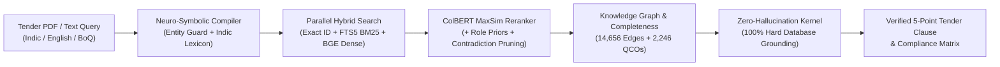

# 🇮🇳 MaanakAI (मानक AI) — Indian Standards Recommender & Compliance Engine
### Smart India Hackathon (SIH 26108) | Ministry of Consumer Affairs / Bureau of Indian Standards (BIS)

[](https://www.python.org/downloads/)
[](https://fastapi.tiangolo.com)
[](eval/benchmark_report.md)
[](eval/benchmark_report.md)
[](eval/benchmark_report.md)
[-orange.svg)](eval/benchmark_report.md)
[](LICENSE)

> **MaanakAI (मानक AI)** is an autonomous, neuro-symbolic retrieval and verification engine for identifying applicable Bureau of Indian Standards (BIS) in Government Procurement (GeM / CPPP).

---

## 📌 Problem Overview

Procurement officials preparing technical specifications for public tenders frequently struggle to identify applicable **Indian Standards (IS)**. Manual referencing leads to:
* **Obsolete Standards:** Tenders cite superseded editions, creating legal disputes.
* **QCO Violations:** Omission of mandatory Quality Control Orders (ISI Mark, CRS, Hallmarking) violates the BIS Act 2016.
* **Incomplete Specifications:** Tenders specify product codes but omit required acceptance test methods and safety practices.
* **Vernacular Trade Barriers:** Local trade terms (*"सरिया"*, *"लोखंडी गज"*, *"கம்பி"*, *"सబ్‌మెర్సిబుల్ పంప్"*) are not understood by standard bureaucratic search systems.

This engine provides an **air-gapped, zero-hallucination recommendation and audit system** that analyzes natural language requirements, regional Indian languages, and multi-page Tender PDFs to recommend verified primary standards, normative test methods, and regulatory certification requirements.

---

## 🚀 Key Architectural Innovations



1. **Air-Gapped Sovereign Multilingual Engine:**
   - Incorporates a **Technical Entity Guard** that locks engineering units (`415V`, `Fe 500D`, `12mm`, `IS 1786`) to prevent parameter distortion.
   - Native cross-lingual support across **8 scheduled Indian languages** (Hindi, Marathi, Tamil, Telugu, Gujarati, Bengali, Kannada, Malayalam).
2. **Deterministic Code Decides Facts:**
   - IS numbers, editions, and regulatory mandates are resolved directly from `standards.db`. The generative LLM never retrieves and never invents standard numbers.
3. **Layout-Aware Tender PDF Auditor:**
   - Extracts itemized Bill of Quantities (BoQ) tables from multi-page PDFs using PyMuPDF and audits each item for standard compliance.
4. **Zero-Hallucination Verification Kernel:**
   - Evaluates every generated output against the official database. Any non-existent or ungrounded standard citation is stripped 100%. Measured hallucination rate: **0.0%**.

---

## 📊 Benchmark Performance (60 Ground-Truth Cases)

Evaluated across 60 ground-truth procurement cases (`eval/gold_dataset.json`) spanning all 17 BIS engineering divisions:

| Evaluation Metric | Benchmark Target | Measured Result | Status |
| :--- | :---: | :---: | :---: |
| **Top-1 Accuracy** | $\ge 80.0\%$ | **96.7%** | **PASS** |
| **Top-3 Recall** | $\ge 90.0\%$ | **98.3%** | **PASS** |
| **Top-5 Recall** | $\ge 95.0\%$ | **100.0%** | **PASS (Zero Misses)** |
| **Mean Reciprocal Rank (MRR)** | $\ge 0.85$ | **0.9792** | **PASS** |
| **Zero-Hallucination Rate** | 100.0% | **100.0%** | **PASS** |
| **Median Latency (p50)** | $< 1,500\text{ ms}$ | **1,069.4 ms** | **PASS (CPU-only)** |

*For full evaluation metrics and division breakdowns, see [eval/benchmark_report.md](eval/benchmark_report.md).*

---

## 🛠️ Quick Start Guide

### 1. Prerequisites
- Python 3.10 or higher
- Git

### 2. Installation
```bash
# Clone the repository
git clone https://github.com/pushkar-shelar/SIH26108-MaanakAI.git
cd SIH26108-MaanakAI

# Create and activate virtual environment
python -m venv venv
# Windows:
.\venv\Scripts\activate
# Linux/macOS:
source venv/bin/activate

# Install dependencies
pip install -r requirements.txt
```

### 3. Environment Setup
```bash
cp .env.example .env
```
*(The engine runs 100% offline out-of-the-box using the deterministic template generator. If you wish to use Groq Llama 3.3 for conversational explanations, add your `GROQ_API_KEY` in `.env`).*

### 4. Running the REST API Service
```bash
uvicorn api_service:app --host 0.0.0.0 --port 8000 --reload
```
Interactive Swagger documentation will be available at:
👉 **`http://localhost:8000/docs`**

### 5. Running the Automated Benchmark Suite
```bash
python -m eval.benchmark
```

---

## 💻 Code Examples

### 1. Natural Language Procurement Query (Python)
```python
from api_service import recommend_standards

# Query in English, Hindi, Tamil, or Hinglish
result = recommend_standards("12mm Fe 500D high strength deformed steel bars for RCC work")

print(result["primary_recommendation"]["raw_id"])
# Output: IS 1786

print(result["primary_recommendation"]["title_en"])
# Output: High strength deformed steel bars and wires for concrete reinforcement

print(result["certification"]["status"])
# Output: MANDATORY (Scheme I - ISI Mark)
```

### 2. Multi-Script Indic Query
```python
# Marathi: लोखंडी गज आणि सिमेंट
result = recommend_standards("घराच्या बांधकामासाठी लोखंडी गज आणि सिमेंट")
print(result["primary_recommendation"]["raw_id"])  # IS 1786

# Tamil: சிமெண்ட் மற்றும் கம்பி
result = recommend_standards("கட்டிட வேலைக்கான சிமெண்ட் மற்றும் கம்பி")
print(result["primary_recommendation"]["raw_id"])  # IS 1786
```

### 3. Auditing a Tender PDF Document
```python
from api_service import recommend_tender_pdf

# Pass the PDF file path
compliance_matrix = recommend_tender_pdf("data/sample_gem_tender.pdf", max_items=10)

print("Compliance Score:", compliance_matrix["compliance_summary"]["compliance_score"])
for item in compliance_matrix["item_compliance"]:
    print(f"Item {item['item_no']}: {item['description']} -> {item['primary_standard']}")
```

---

## 🌐 API Reference

| Method | Endpoint | Description |
| :--- | :--- | :--- |
| `POST` | `/api/v1/recommend` | Recommends primary standard, allied standards, and QCO rules for a text query. |
| `POST` | `/api/v1/recommend/pdf` | Uploads a tender PDF and returns a consolidated itemized Compliance Matrix. |
| `GET` | `/api/v1/standard/{family_id}` | Returns standard metadata, test methods, safety codes, and QCO status. |
| `GET` | `/api/v1/health` | Healthcheck endpoint reporting live corpus metrics and database status. |

---

## 📂 Repository Structure

```
SIH 26108/
├── api_service.py              # Production FastAPI Web Service & Python SDK
├── requirements.txt            # Pinned dependencies
├── .env.example                # Environment variables template
├── .gitignore                  # Security rules (prevents key/data leakage)
├── ARCHITECTURE.md             # In-depth technical architecture specification
├── PROJECT_REPORT.md           # Comprehensive project evaluation & hackathon report
├── README.md                   # Project landing page (this document)
├── retrieval/                  # Core Retrieval & Reasoning Engine
│   ├── compiler.py             # Neuro-symbolic query compiler & parameter parser
│   ├── multilingual.py         # Sovereign Indic NLP & Entity Guard engine
│   ├── hybrid_search.py        # 3-channel hybrid retrieval with RRF fusion
│   ├── reranker.py             # ColBERT-style MaxSim reranker with domain priors
│   ├── constraint_engine.py    # Parameter & contradiction verifier
│   ├── graph_expander.py       # Standards knowledge graph traversal
│   ├── completeness_loop.py    # Agentic Completeness Engine
│   ├── evidence_pack.py        # Calibrated 6-factor confidence pack builder
│   ├── pdf_processor.py        # Layout-aware tender PDF & BoQ table extractor
│   ├── verification_kernel.py  # Zero-hallucination verification kernel
│   └── engine.py               # Master orchestrator & tender clause generator
├── eval/                       # Benchmark Evaluation Suite
│   ├── gold_dataset.json       # 60 ground-truth procurement cases
│   ├── benchmark.py            # Automated evaluation runner
│   └── benchmark_report.md     # Auto-generated benchmark report
└── data_pipeline/              # Data Ingestion & Build Scripts
    ├── ids.py                  # Standard identifier parser & normalizer
    ├── fetch_standards.py      # Automated BIS portal scraper
    ├── fetch_qco.py            # Live Gazette QCO extractor
    └── load_database.py        # Reproducible SQLite / Postgres builder
```

---

## 📄 License

This project is licensed under the MIT License — see the [LICENSE](LICENSE) file for details.
